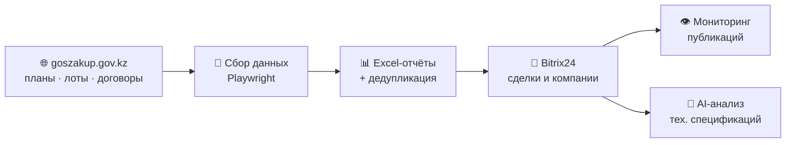
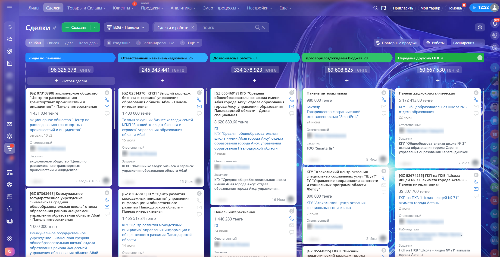
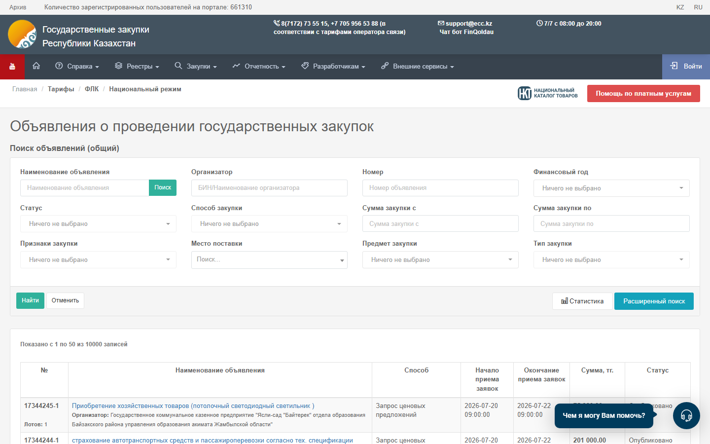
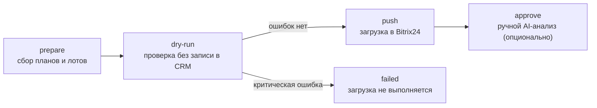

# Scrape2Lead — Госзакупки → Bitrix24


**Робот, который каждый день собирает государственные закупки Казахстана и превращает их в сделки Bitrix24.**

Он сам заходит на портал [goszakup.gov.kz](https://goszakup.gov.kz), выгружает планы и лоты по нужным
ключевым словам, чистит дубликаты, заводит сделки и компании в CRM, следит за публикацией закупок
и умеет читать технические спецификации с помощью AI (vision-моделей).

## Как это работает



Каждый день GitHub Actions запускает пайплайн автоматически (время алматинское):
в **08:40** — сбор PK-планов, в **10:00** — основной сбор (планы + лоты).
Результат — свежие сделки в воронках B2G, без ручной работы и без привязки к рабочему компьютеру.

## Скриншоты

**Воронка B2G в Bitrix24** — сделки, созданные роботом из лотов госзакупок
(в заголовке каждой — номер `[GZ …]`, внутри — заказчик, сумма и ссылка на закупку):



**Источник данных** — портал государственных закупок РК, откуда робот собирает объявления:



## Быстрый старт

Понадобятся: Node.js 20+, Chromium для Playwright, Poppler (`pdfinfo`, `pdftoppm`) для анализа PDF
и входящий webhook Bitrix24.

```powershell
npm ci
npx playwright install chromium
Copy-Item .env.example .env   # заполните BITRIX24_WEBHOOK_URL и нужные ключи
npm run automation:run        # полный цикл: сбор -> проверка -> загрузка в Bitrix
```

Файл `.env` хранит секреты и никогда не попадает в Git.

## Ежедневная автоматизация

Жизненный цикл каждого запуска:



Каждый запуск сохраняется в `runs/<run-id>/` с манифестом и контрольными суммами.
Пример реального `summary.txt`:

```text
run=20260718-103316
workflow=plans-and-lots
status=pushed
exportPlans=succeeded
exportLots=succeeded
dryRunPlans=succeeded
dryRunLots=succeeded
applyPlans=succeeded
applyLots=succeeded
```

| Команда | Что делает |
|---|---|
| `npm run automation:prepare` | Собирает планы и лоты за 6 месяцев, делает dry-run. CRM не трогает |
| `npm run automation:run` | `prepare` + автоматическая загрузка в Bitrix, если dry-run чистый |
| `npm run automation:status -- --run <id>` | Показывает состояние конкретного запуска |
| `npm run automation:push -- --run <id>` | Дозагружает пакет (умеет продолжать после частичного сбоя) |
| `npm run automation:approve -- --run <id>` | Запускает ручной AI-анализ лотов |
| `npm run automation:run:sh -- <config> <log>` | Тот же запуск через POSIX-раннер (GitHub Actions, cron, systemd) |
| `npm run automation:install-task` | Ставит ежедневное задание Windows на 10:00 (legacy, для локального фолбэка) |
| `npm run automation:install-pk-task` | Ставит ежедневное задание PK-планов на 08:40 (legacy) |

<details>
<summary><b>Подробности: статусы, повторные запуски, PK-задание, lock</b></summary>

- `push` сверяет SHA-256 артефактов перед загрузкой. Если планы уже загружены, а лоты — нет
  (частичный сбой), повторный `push` продолжит с лотов без повторной отправки планов.
  Повторная загрузка полностью выгруженного запуска запрещена.
- `approve` также сверяет SHA-256. Для запуска со статусом `pushed` он выполняет только ручной
  AI-анализ лотов; для запуска `ready` — применяет планы, лоты и AI. Повторный approve
  завершённого запуска запрещён; после ошибки AI та же команда продолжит только AI-этап.
- Основное задание работает по `config/automation.json`, лог — `runs/scheduler.log`.
  Если планы или лоты не собраны либо dry-run содержит критическую ошибку, запуск получает
  статус `failed` и загрузка не выполняется.
- Задание `Scrape2Lead Daily PK Plans` работает по `config/automation.pk.json` в режиме
  `"workflow": "plans-only"`: собирает только планы по `config/gz-plans.pk.json`, выполняет
  dry-run и отправляет планы в Bitrix. Лоты и AI не запускаются, `automation:approve` для
  такого запуска отклоняется — планы отправляются через `automation:push`.
  Запуски хранятся в `runs/pk/`, лог — `runs/pk/scheduler.log`. PK-ключевые слова
  маршрутизируются в Bitrix category `9` / stage `C9:NEW` по `config/bitrix-gz-routing.json`.
- Сбор никогда не идёт параллельно. На локальном запуске это обеспечивает общий lock
  `runs/prepare.lock`; в GitHub Actions раннеры эфемерные и файла на них нет, поэтому
  взаимное исключение держит общая `concurrency`-группа `gz-automation` — второй прогон
  ждёт в очереди, а не стартует поверх первого.
- Любой запуск можно выполнить вручную с явным конфигом:
  `npm run automation:run -- --config config/automation.pk.json`.

</details>

### Запуск в GitHub Actions

Обе ежедневные задачи живут в `.github/workflows/`:

| Workflow | Расписание | Конфиг |
|---|---|---|
| `gz-daily-pk.yml` | `40 3` и `40 4` UTC = 08:40 и 09:40 Алматы | `config/automation.pk.json` |
| `gz-daily-main.yml` | `0 5` и `0 6` UTC = 10:00 и 11:00 Алматы | `config/automation.json` |
| `gz-automation.yml` | — | Общее тело, вызывается двумя предыдущими |
| `gz-watchdog.yml` | `30 7 * * *` UTC = 12:30 Алматы | Падает, если сегодня не отработала хотя бы одна из задач |
| `gz-probe.yml` | вручную | Проверяет, отвечает ли goszakup с раннеров GitHub |

Второй cron у каждой задачи — backstop. Он спрашивает через API, есть ли сегодня
успешный **или ещё идущий** прогон этого же workflow, и пропускает себя, если есть;
фактическая работа выполняется один раз в день. Упавший прогон backstop не блокирует —
ради этого он и нужен.

Казахстан живёт в UTC+5 без перехода на летнее время, поэтому смещение постоянное.
Оба workflow можно запустить вручную кнопкой **Run workflow** или через
`gh workflow run gz-daily-pk.yml`.

Требуется один секрет репозитория — `BITRIX24_WEBHOOK_URL`. `GOSZAKUP_TOKEN` не нужен:
сбор идёт по HTML-порталу.

<details>
<summary><b>Подробности: кэш, артефакты, что делать если прогон упал</b></summary>

- **Кэш.** `data/scrape2lead.db` переносится между прогонами через `actions/cache`.
  Это ускоритель, а не источник правды: дедупликация сделок живёт в Bitrix
  (`UF_CRM_PLAN_ID` / `ORIGINATOR_ID`), поэтому потеря кэша делает прогон медленным
  (~65 мин вместо ~10), но не приводит к дублям. Ключи в GHA неизменяемы, поэтому
  кэш восстанавливается по префиксу `gz-db-`, а сохраняется под ключом с `run_id`.
- **Артефакты.** Каталог прогона (`manifest.json`, `plans.xlsx`, `*-dry-run.json`,
  `summary.txt`, `run.log`) прикладывается к job и хранится 30 дней — это замена
  локальной папки `runs/`.
- **Если прогон упал:** открыть вкладку Actions → упавший запуск → шаг `Show run log`.
  Строка `scheduler automation:run status=failed exit=<код>` показывает, дошло ли дело
  до Bitrix. Скачать артефакт и посмотреть `manifest.json`: поле `errors` содержит
  причину, `stages` — на каком этапе остановились. Повторный запуск безопасен —
  уже созданные сделки распознаются как `existing`.
- **Если прогон не создал ни одной записи** — это чаще всего норма, а не сбой.
  Собирается скользящее окно в 6 месяцев, поэтому подавляющее большинство планов
  повторяется изо дня в день и распознаётся как `existing`. Новые сделки появляются
  только тогда, когда госзакуп опубликовал новые подходящие планы. Смотреть надо на
  `manifest.json`: `status: pushed` без `errors` означает, что пайплайн отработал,
  независимо от количества `create`.
- **Если прогон не запустился вообще.** GitHub задерживает и иногда вовсе не доставляет
  scheduled события — 2026-07-26 запуск на 08:40 не был создан, и это заметили только
  по отсутствию новых записей. Отсюда backstop-триггеры и `gz-watchdog.yml`. Убедиться,
  что задача сегодня отработала:
  ```bash
  gh run list --workflow gz-daily-pk.yml --limit 5
  ```
  Если запуска нет — запустить вручную; повторный прогон безопасен.
- **Ограничение GitHub:** scheduled workflows автоматически отключаются после 60 дней
  без активности в репозитории. При регулярных коммитах не проблема; иначе их нужно
  включить вручную в интерфейсе Actions.

</details>

## Справочник команд

### Сбор и подготовка данных

| Команда | Что делает |
|---|---|
| `npm run kz:export-gz-plans` | Выгружает планы закупок по конфигу `config/gz-plans*.json` |
| `npm run kz:export-lots-nstru` | Выгружает лоты по кодам ЕНС ТРУ из `Nstru.txt` |
| `npm run kz:export-lots-computers` | Выгружает лоты по конфигу `config/gz-lots-computers.json` |
| `npm run kz:export-gz-contracts -- --config config/gz-contracts-panels.json` | Выгружает договоры из публичного реестра |
| `npm run kz:dedupe-gz-plans -- --input exports/input.xlsx` | Чистит дубликаты в Excel-отчёте |

<details>
<summary><b>Подробности экспорта договоров</b></summary>

Экспорт договоров ищет каждый код ЕНС ТРУ отдельно в публичном реестре за период с `2026-01-01`
по текущую дату. Результат в `exports/` содержит БИН заказчика, название заказчика, БИН/ИИН
поставщика, название поставщика и код поиска.
Параметры: `--from`, `--to`, `--out`, `--limit`, `--max-pages`, `--headful`, `--dry-run`.

</details>

### Bitrix24

> ⚠️ Команды, изменяющие CRM, сначала запускайте в dry-run/preview-режиме. Перед execute-проходом
> проверьте воронку, ответственного и число найденных записей.

| Команда | Что делает |
|---|---|
| `npm run bitrix:import -- --config … --file … --dry-run` | Универсальный импорт Excel → CRM |
| `npm run kz:bitrix-push-gz-plans -- --input … --limit 10` | Загружает планы сделками |
| `npm run kz:bitrix-push-gz-deals -- --input … --limit 10` | Загружает сделки из планов |
| `npm run kz:bitrix-push-gz-lots -- --input … --limit 10 --no-company` | Загружает лоты сделками |
| `npm run bitrix:gz-duplicate-hygiene -- --help` | Ищет и архивирует дубликаты GZ-сделок |
| `npm run bitrix:backfill-gz-origin -- --help` | Дозаполняет поля происхождения сделок |
| `npm run bitrix:migrate-gz-categories -- --help` | Переносит legacy-сделки между воронками B2G |

### Мониторинг и AI-анализ

| Команда | Что делает |
|---|---|
| `npm run kz:check-gz-deals-published` | Проверяет, опубликованы ли «Утверждённые» сделки на Goszakup |
| `npm run kz:check-gz-deals-published -- --limit 10 --execute` | То же с записью статуса в CRM |
| `npm run kz:monitor-gz-published-leads -- --dry-run` | Монитор публикаций (пакетный режим) |
| `npm run kz:analyze-gz-specs -- --limit 10` | AI-анализ технических спецификаций лотов |

<details>
<summary><b>Подробности монитора и анализатора</b></summary>

Монитор публикаций обновляет только статус сделки: у сделок со статусом «Утвержден»,
опубликованных на Goszakup, он записывает «Опубликован» в `UF_CRM_PLAN_STATUS` (и в устаревшее
совместимое поле), а при первом обнаружении — дату в `UF_CRM_S2L_GZ_PUBLISHED_AT`.
Стадии и воронки Bitrix не изменяются, `STAGE_ID` никогда не передаётся. Сделки с другим,
пустым или уже опубликованным статусом попадают в отчёт как пропущенные.

Анализатор использует OpenCode vision по умолчанию и поддерживает Anthropic как альтернативный
провайдер. Во внешнюю модель отправляются только публичные тендерные документы.

</details>

## Проверка проекта

```powershell
npm run build
npm run lint
npm test
npm run test:coverage
npm audit
```

## Структура проекта

```text
scripts/        исполняемые команды GZ и Bitrix24
src/kz/         сбор, парсинг и экспорт госзакупок
src/bitrix/     клиент, импорт, маршрутизация и обслуживание CRM
src/analysis/   загрузка и vision-анализ тех. спецификаций
config/         примеры и рабочие конфигурации пайплайна
tests/          тесты поддерживаемого контура
docs/           документация и скриншоты
```

Генерируемые файлы пишутся в `data/`, `exports/`, `logs/`, `tmp/` и `raw_snapshots/` —
их содержимое не версионируется.

## Дополнительная документация

- [Импорт Bitrix24](docs/bitrix-import.md) — универсальный конфигурируемый импорт Excel → CRM
- [AI-анализ спецификаций](docs/ai-spec-analysis.md) — настройка vision-провайдеров и промптов
