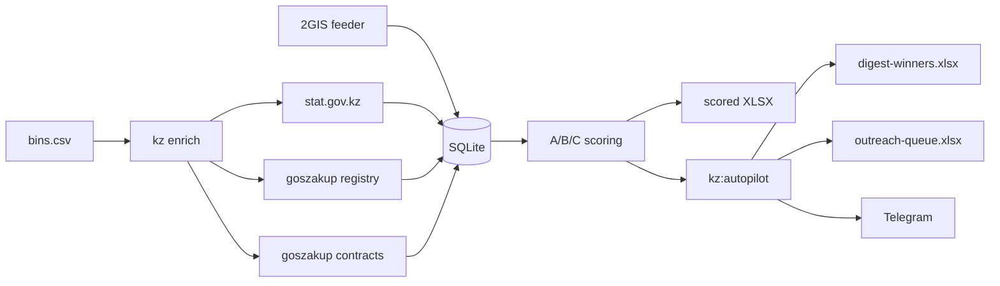

# Scrape2Lead — KZ Company Intelligence


**Sales intelligence по госзакупкам Казахстана.** CSV с БИНами на входе — скоринговые Excel-отчёты и еженедельный аутрич-дайджест на выходе: юрданные stat.gov.kz, контакты из реестра goszakup, контракты поставщиков, телефоны из 2GIS.

| | |
|---|---|
| **Продукт (v2)** | БИНы → enrich → scored XLSX для продаж и мониторинга тендеров |
| **Autopilot** | еженедельный дифф «новые победители + новые активные закупки» → файлы + Telegram |
| **Feeder (v1.7)** | 2GIS/Kaspi-скрейп как источник телефонов и имён для BIN-backfill |

Spec: [`docs/TZ_v2.md`](docs/TZ_v2.md) · [Как работает конвейер](docs/pipeline-overview.md) · Batch ops: [`docs/kz-batch-runbook.md`](docs/kz-batch-runbook.md) · Sales kit: [`docs/sales-kit.md`](docs/sales-kit.md)

---

## Пайплайн



---

## Quick start

```bash
npm install
npx playwright install chromium
cp .env.example .env
```

`bins.csv` — по одному 12-значному БИНу на строку (заголовок `bin` опционален):

```text
bin
061040006408
960440000716
```

```bash
npm run kz:login                              # сессия stat.gov (QR или ЭЦП)
npm run dev -- kz enrich bins.csv             # stat + registry + tenders
npm run kz:export -- --bins bins.csv          # XLSX: Companies, Tenders, Summary, Errors
```

Собрать БИНы ТОО из публичного реестра goszakup:

```bash
npm run kz:harvest -- 50 bins-batch-50.csv
```

---

## Outreach Autopilot

Одна команда раз в неделю: инкрементальный enrich → дифф «что нового с прошлого запуска» → два продающих артефакта → Telegram.

```bash
# Первый запуск — baseline: фиксирует текущее состояние, ничего не экспортирует
npm run kz:autopilot

# Еженедельный запуск с прогрессом и лимитом страниц goszakup
npm run kz:autopilot -- --progress --max-pages 5

# Дифф без браузера (для планировщика)
npm run kz:autopilot -- --skip-enrich
```

| Артефакт | Что внутри | Для кого |
|----------|-----------|----------|
| `exports/digest-winners-<дата>.xlsx` | Свежие победители закупок: контракт, сумма, заказчик, телефон/email директора | Факторинг, банки, гарантии |
| `exports/outreach-queue-<дата>.xlsx` | Top-A компании с новыми активными закупками + готовые WhatsApp-сообщения и `wa.me`-ссылки | Поставщики стройматериалов и услуг |

Дедуп через `outreach_items`: пара (БИН, номер тендера) попадает в дайджест один раз. Telegram-бот (опционально, `TELEGRAM_BOT_TOKEN`/`TELEGRAM_CHAT_ID`) присылает сводку, черновик письма и оба файла.

Флаги: `--since <дата>` · `--dry-run` · `--skip-enrich` · `--progress` · `--max-pages <n>` · `--baseline` — подробности в [runbook, §6](docs/kz-batch-runbook.md).

---

## Источники данных

| Источник | Роль | Auth |
|----------|------|------|
| **stat.gov.kz** | Primary: имя, ОКЭД, директор, адрес, регистрация | QR/ЭЦП-сессия (`kz:login`) |
| **goszakup registry** | Телефон, email, сайт, participant ID | Публичный HTML |
| **goszakup HTML** | **Контракты** поставщика по БИН | Публичный сайт (Playwright) |
| **goszakup API** | Тендеры по БИН | `GOSZAKUP_TOKEN` (опционально) |
| **zakup.sk.kz** | Лоты Самрук-Казына по имени | Публичный (консервативный фильтр) |
| **2GIS / Kaspi** | Feeder: контакты + имена → BIN backfill | Публичный скрейп |

Без `GOSZAKUP_TOKEN` контракты всё равно собираются через goszakup HTML; API-тендеры пропускаются.

---

## Команды

| Команда | Описание |
|---------|----------|
| `npm run kz:login` | Сессия stat.gov → `data/stat-gov-session.json` |
| `npm run kz:enrich -- bins.csv` | Полный enrich-пайплайн |
| `npm run kz:autopilot` | **Еженедельный аутрич-дайджест** (см. выше) |
| `npm run kz:registry -- bins.csv` | Только публичный реестр goszakup |
| `npm run kz:export -- --bins bins.csv` | KZ XLSX со скорингом |
| `npm run kz:export-sales-top-a` | Sales-срез: Top-A с контактами в один лист |
| `npm run kz:export-unified` | Unified XLSX: 2GIS-лиды + KZ + скоринг |
| `npm run kz:feeder-top-a -- bins.csv` | Top-A feeder: 2GIS → backfill BIN → enrich → unified |
| `npm run kz:audit -- bins.csv` | Аудит качества (эвристики zakup) |
| `npm run kz:harvest -- N out.csv` | Сбор БИНов ТОО из реестра goszakup |
| `npm run kz:export-gz-plans` | **Планы ГЗ** по ключевым словам (Июнь–Август) → XLSX с контактами заказчиков |

CLI-эквиваленты: `npm run dev -- kz login|enrich|export|merge|export-unified …`

### Экспорт планов ГЗ (доски / панели)

Поиск в [реестре планов](https://goszakup.gov.kz/ru/registry/plan) по ключевым словам, детализация пунктов, обогащение заказчиков из goszakup registry, Excel с БИН, СТРУ, датой акта и контактами.

Настройки подбора — в [`config/gz-plans.json`](config/gz-plans.json) (образец: [`config/gz-plans.example.json`](config/gz-plans.example.json)). Приоритет: **CLI-флаги** → **`.env`** (`GOSZAKUP_PLAN_MAX_PAGES`, `KZ_ENRICH_DELAY_MS`) → **JSON** → дефолты в коде. Секрет `GOSZAKUP_TOKEN` — только в `.env`.

| Поле JSON | Описание |
|---|---|
| `keywords` | Ключевые слова поиска |
| `year`, `months` | Год и месяцы плана (1–12) |
| `statuses` | Статусы пунктов, напр. `["Утвержден"]` или `["2"]`; `[]` — без фильтра |
| `maxPages`, `delayMs` | Пагинация и пауза между запросами |
| `skipRegistry` | Пропустить обогащение контактами |
| `outPath` | Путь к XLSX (`null` — `exports/gz-plans-YYYY-MM-DD.xlsx`) |

```bash
npm run kz:export-gz-plans
npm run kz:export-gz-plans -- --config config/gz-plans.json
npm run kz:export-gz-plans -- --out exports/gz-plans-panels.xlsx
npm run kz:export-gz-plans -- --statuses "Утвержден,Опубликован"
npm run kz:export-gz-plans -- --max-pages 1 --skip-registry   # smoke без registry
```

По умолчанию в конфиге: три ключевых слова (доски/панели), месяцы 6/7/8, год 2026, статус **Утвержден**. С `GOSZAKUP_TOKEN` детали пункта и администратор отчётности берутся из API `/v2/plans/view`.

### Частичные перезапуски enrich

```bash
npm run dev -- kz enrich bins.csv --skip-stat
npm run dev -- kz enrich bins.csv --skip-tenders
npm run dev -- kz enrich bins.csv --registry-only
npm run dev -- kz enrich bins.csv --force-refresh --delay-ms 2000
```

### Unified export (2GIS + KZ)

```bash
npm run dev -- kz merge
npm run dev -- kz export-unified --priority A --out exports/unified.xlsx
npm run dev -- kz export-unified --enrich-missing --priority A
```

### Top-A feeder (2GIS → sales-файл)

```bash
cp config.feeder.example.json config.feeder.json
cp config.feeder.astana.example.json config.feeder.astana.json

npm run kz:feeder-top-a -- bins-batch-100.csv \
  --config config.feeder.json \
  --config config.feeder.astana.json
```

Feeder: top-A extract → 2GIS scrape → batch BIN backfill → enrich → merge → unified export. БД по умолчанию `data/scrape2lead.db` (`KZ_DATABASE_PATH` для переопределения).

---

## Скоринг

Приоритет считается по активным закупкам компании (`src/kz/kzLeadScore.ts`):

| Приоритет | Критерий (любой) |
|-----------|------------------|
| **A** | ≥10 активных · бюджет активных ≥ 50 млн ₸ · ≥5 активных и ≥10 млн ₸ |
| **B** | ≥3 активных · бюджет ≥ 1 млн ₸ · ≥20 закупок всего |
| **C** | Есть закупки, но ниже порогов B |

---

## Development

```bash
npm run build
npm test          # вся сюита
npm run lint      # tsc --noEmit
npx vitest run tests/kz
```

Требования: Node.js ≥ 20, npm ≥ 9, Playwright Chromium.

---

## Переменные окружения

Скопируй `.env.example` → `.env`.

| Переменная | Описание |
|-----------|----------|
| `GOSZAKUP_TOKEN` | Bearer-токен goszakup OWS API (опционально) |
| `GOSZAKUP_HTML_MAX_PAGES` | Лимит страниц goszakup HTML на БИН (default: 50; CLI `--max-pages` приоритетнее) |
| `GOSZAKUP_PLAN_MAX_PAGES` | Лимит страниц поиска планов ГЗ (default: 50) |
| `TELEGRAM_BOT_TOKEN` / `TELEGRAM_CHAT_ID` | Уведомления автопилота (опционально) |
| `STAT_GOV_SESSION_PATH` | Файл сессии stat.gov (default: `data/stat-gov-session.json`) |
| `STAT_GOV_CACHE_TTL_DAYS` | TTL кэша stat.gov (default: 7) |
| `GOSZAKUP_REGISTRY_CACHE_TTL_DAYS` | TTL кэша реестра (default: 7) |
| `KZ_ENRICH_DELAY_MS` | Пауза между БИНами (default: 2000) |
| `KZ_DATABASE_PATH` | SQLite для KZ/feeder (default: `data/scrape2lead.db`) |
| `STORAGE_BACKEND` | `sqlite` (default) или `postgres` |
| `POSTGRES_CONNECTION_STRING` | Обязательна при `STORAGE_BACKEND=postgres` |
| `PROXY_*` | Ротация прокси для 2GIS/Kaspi |

Сессии и токены живут в `data/` и `.env` — в git не попадают.

---

## Legacy: 2GIS / Kaspi scrape (v1.7)

Ядро платформы: адаптеры источников, JobManager, нормализатор, ротация прокси, телеметрия, SQLite/Postgres.

```bash
cp config.example.json config.json
npm run dev -- --config config.json --geo "Алматы" --category "Автосервисы" --limit 25

# Fixture-режим (без сети)
npm run dev -- --fixture tests/fixtures/2gis-response.json \
               --geo astana --category autoservice --limit 10
```

2GIS остаётся полезен как **feeder** (телефоны + имена), мерджится с KZ-данными через `kz:merge` и `kz:export-unified`.

---

## Структура проекта

```
src/
  kz/           коллекторы stat.gov/goszakup/zakup, скоринг, экспортёры, autopilot-модули
  adapters/     адаптеры 2GIS, Kaspi
  enrichment/   обогащение контактов и lead scoring (legacy)
  storage/      миграции SQLite + Postgres backend
  export/       CSV/XLSX-хелперы
  core/         JobManager, rate limiter, телеметрия
  cli.ts        CLI + `kz` сабкоманды
scripts/        коллекторы, feeder, harvest, autopilot, smoke-тесты
docs/           TZ v2, runbooks, sales kit, шаблоны сообщений
data/           SQLite, сессии (runtime, gitignored)
exports/        XLSX/CSV (runtime, gitignored)
```

---

## Changelog

### v1.7.0 — current (`develop`)

Latest release train (post-merge `c3a495d`):

- **Operator / release readiness**
  - Documented release environment variables and health-response shape.
  - Added `docs/release-checklist.md` — CI gate for `develop → main`.
- **Server / operator UI**
  - Fixed Windows job spawn (`EINVAL`) by running jobs via `node.exe` instead of `npx.cmd`.
  - `/operator` dashboard can submit `kz-enrich`/`kz-export`, stream logs and download artifacts.
- **Autopilot / sales helpers**
  - Removed public Telegram freemium channel layer; digest stays private/operator-only.
  - Added sales factoring buyer workbook (`scripts/make-factoring-targets.mts`).
- **Docs**
  - `docs/pipeline-overview.md` — end-to-end operator guide.
  - `docs/foreign-market-research.md` — expansion research template.
  - `docs/kz-batch-runbook.md` — batch 50–100 BIN, autopilot, scheduler.

See `docs/BACKLOG.md` for candidate next increments and `docs/ARCHIVE_AUDIT.md` for the legacy-script / prompt archive audit.

---

## Документация

| Документ | Назначение |
|----------|-----------|
| [`docs/TZ_v2.md`](docs/TZ_v2.md) | Полная спека: источники, схема, критерии приёмки |
| [`docs/kz-batch-runbook.md`](docs/kz-batch-runbook.md) | Batch 50–100 БИН, аудит, autopilot, планировщик |
| [`docs/sales-kit.md`](docs/sales-kit.md) | Скрипты продаж, сегменты, цены |
| [`docs/whatsapp-messages.md`](docs/whatsapp-messages.md) | Готовые сообщения для аутрича |
| [`docs/TENDERS.md`](docs/TENDERS.md) | goszakup HTML: контракты vs объявления |
