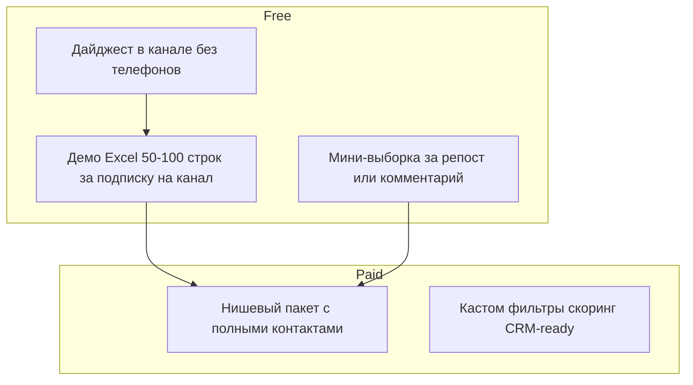

# Freemium-модель AI Leads KZ

Лид-магнит — да. «Вся база за подписку» — нет: обесценивает продукт (забрали → отписались → перезалили).

**Продаём не «базу», а готовые лиды:**  
*«100 компаний в Алматы, которым вероятно нужен X — с источником, категорией, активностью, контактным каналом».*

---

## Роли площадок (Казахстан)

| Площадка | Роль | Обязательность |
|----------|------|----------------|
| **Telegram-канал** | Основной: дайджест, демо-файлы, кейсы, обновления | **Главный** |
| **Instagram** | Витрина: [instagram.com/ai.leads.kz](https://www.instagram.com/ai.leads.kz/) — скрины Excel, Reels, ссылка на TG | Высокий приоритет (~12.4M охват в KZ) |
| **Threads** | [threads.com/@ai.leads.kz](https://www.threads.com/@ai.leads.kz) — дублирование веток, **не обязательный** канал | Опционально |

Не требовать подписку на IG + Threads + TG одновременно.

---

## Три слоя ценности



### 1. За подписку на Telegram-канал

- **Демо Excel: 50–100 строк** (по умолчанию 50).
- Поля: БИН, компания, предмет, сумма, заказчик, ссылка goszakup.
- **Телефоны и email замаскированы** (`+7 (7XX) XXX-XX-XX`, `u***@mail.ru`).
- Выдача: ссылка в закрепе канала или файл в личку бота после проверки подписки (пока вручную).

Команда генерации:

```powershell
npm run kz:freemium-demo
npm run kz:freemium-demo -- --rows 100
```

### 2. За вовлечение (репост / комментарий / реакция)

- **Еженедельная мини-выборка: 15–20 строк** — чуть больше деталей, чем дайджест в ленте, но **без полной раздачи телефонов**.
- Публикуется по пятницам в канале: «Оставьте реакцию / комментарий — пришлю мини-файл в личку».
- Команда:

```powershell
npm run kz:freemium-demo -- --mini
```

### 3. Платно

| Продукт | Что входит |
|---------|------------|
| **Нишевый пакет** | Полные телефоны, email, директор, Excel под задачу |
| **Goszakup retail** | 5 / 9 900 ₸ · 15 / 19 900 ₸ |
| **Kaspi** | 15 / 9 900 ₸ |
| **Кастом** | Фильтры, свежий прогон, сегмент, скоринг, CRM-ready |
| **Подписка (фаза 3)** | Еженедельный файл + ниша + полные контакты |

**Не продаём:** «всю базу КЗ», сырой дамп без ниши.

---

## Позиционирование (скрипты)

| Не говорить | Говорить |
|-------------|----------|
| База компаний | Готовые лиды под вашу нишу |
| Купить Excel | 100 компаний в Алматы с контрактом и контактом |
| Вся Казахстан | Свежие победители тендеров за неделю |

---

## Техническая реализация

| Артефакт | Путь |
|----------|------|
| Маскировка + экспорт демо | `src/kz/freemiumDemoExport.ts` |
| CLI | `scripts/export-freemium-demo.mts` → `npm run kz:freemium-demo` |
| Публичный дайджест (без телефонов) | `src/kz/channelDigest.ts` |
| Autopilot → канал | `scripts/kz-autopilot.mts` |

Переменные `.env`:

```env
FREEMIUM_DEMO_ROWS=50
FREEMIUM_MINI_ROWS=15
```

---

## Риски

1. **50–100 строк с открытыми телефонами** — нельзя; только маскировка.
2. **Демо в открытом канале** — только ссылка «напишите боту» или закреп, не файл в ленту.
3. **Threads как обязательный гейт** — не использовать.

---

## Связанные документы

- [telegram-channel-kit.md](./telegram-channel-kit.md)
- [telegram-digest-template.md](./telegram-digest-template.md)
- [dm-scripts-freemium.md](./dm-scripts-freemium.md)
- [sales-kit.md](./sales-kit.md)
- [sales-kit.md](./sales-kit.md)
