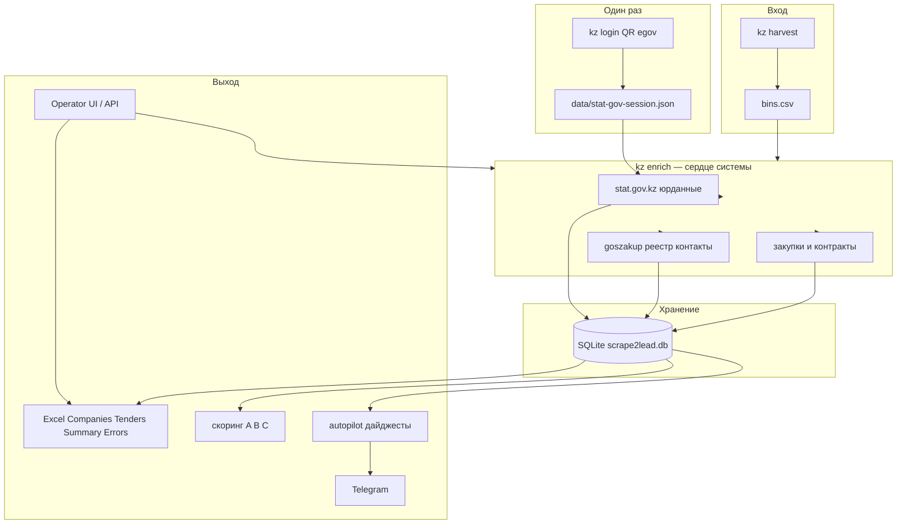

# Как работает наш конвейер (простыми словами)

## Одной фразой

На входе — **список БИНов** (12-значные идентификаторы казахстанских компаний). Система **ходит по государственным сайтам**, собирает юрданные и закупки, **складывает всё в SQLite**, **оценивает «горячесть» лида** и **выдаёт Excel** (или еженедельный дайджест в Telegram).

---

## Общая схема



---

## Шаг 0: Откуда берутся БИНы

- **Вручную** — файл `bins.csv`, по одному БИНу на строку.
- **Автоматически** — `npm run kz:harvest` вытаскивает БИНы ТОО из публичного реестра goszakup (например, первые 50 компаний → CSV).

БИН — это «паспорт» компании в Казахстане. Всё в системе крутится вокруг него.

---

## Шаг 1: Авторизация на stat.gov (раз в сессию)

Команда: `npm run kz:login` → [`scripts/stat-gov-login.ts`](../scripts/stat-gov-login.ts)

- Открывается браузер (Playwright), оператор логинится через **egov mobile (QR)**.
- Сохраняется файл сессии: `data/stat-gov-session.json` (в git не коммитится).
- Без него **stat.gov не отдаёт** юрданные — enrich упадёт на этом этапе.

Это не «пароль в коде», а сохранённые cookies браузера, как «остаться залогиненным».

---

## Шаг 2: Enrich — сбор данных по каждому БИНу

Команда: `npm run kz:enrich -- bins.csv`  
Логика: [`src/kz/enrichPipeline.ts`](../src/kz/enrichPipeline.ts)

Для каждого БИНа подряд идут **три коллектора** (между запросами пауза `delayMs`, по умолчанию 2 сек — чтобы не забанили):

### 2a. stat.gov.kz — «кто это юридически»

[`src/kz/statGovCollector.ts`](../src/kz/statGovCollector.ts)

- Playwright открывает кабинет stat.gov, вводит БИН.
- Парсит HTML: **название, директор, адрес, ОКЭД, дата регистрации**.
- **Кэш**: если данные свежие (TTL ~7 дней), повторно не ходит.
- Ошибки пишет в таблицу `kz_enrich_errors`.

### 2b. goszakup registry — «как с ними связаться»

[`src/kz/goszakupRegistryCollector.ts`](../src/kz/goszakupRegistryCollector.ts)

- Публичный HTML реестра участников закупок.
- Телефон, email, сайт, participant ID.
- Тоже с кэшем.

### 2c. Закупки и контракты — «чем компания живёт в госзакупках»

[`src/kz/tendersPipeline.ts`](../src/kz/tendersPipeline.ts) — три подисточника:

| Источник | Как ищет | Что даёт |
|----------|----------|----------|
| **zakup.sk.kz** (Самрук) | По **названию** компании из stat.gov | Лоты через Playwright + перехват API |
| **goszakup API** | По **БИН** | Тендеры (нужен `GOSZAKUP_TOKEN`, иначе пропускается) |
| **goszakup HTML** | По **БИН** | Контракты поставщика, лоты (браузер) |

Всё нормализуется в единую таблицу `tender_data` с полями: источник, номер тендера, заказчик, бюджет, статус, даты, URL.

---

## Шаг 3: База данных — «память» системы

Файл по умолчанию: `data/scrape2lead.db` (SQLite, [`src/kz/kzStorage.ts`](../src/kz/kzStorage.ts))

Основные сущности:

- `stat_gov_data` — карточка компании с stat.gov
- контакты из реестра goszakup
- `tender_data` — все закупки/контракты
- `kz_enrich_errors` — что не удалось собрать и почему
- `outreach_items` / `outreach_runs` — что уже отдавали в дайджест (дедуп)

Данные **накапливаются**: повторный enrich дополняет/обновляет, а не стирает всё.

---

## Шаг 4: Export — Excel для человека

Команда: `npm run kz:export` → [`src/kz/kzExporter.ts`](../src/kz/kzExporter.ts)

Читает БД и собирает **один XLSX** с листами:

- **Companies** — сводная карточка (stat + контакты + счётчики тендеров)
- **Tenders** — плоский список закупок
- **Summary** — статистика по источникам и статусам
- **Errors** — ошибки enrich

### Скоринг A / B / C

[`src/kz/kzLeadScore.ts`](../src/kz/kzLeadScore.ts) — простые правила по активности:

- **A** — много активных тендеров или большой бюджет (горячий лид)
- **B** — средняя активность
- **C** — есть закупки, но скромно
- пусто — закупок не нашли

Это не ML, а пороги по количеству и сумме.

---

## Шаг 5: Autopilot — еженедельный «что нового»

Команда: `npm run kz:autopilot` → [`scripts/kz-autopilot.mts`](../scripts/kz-autopilot.mts)

Логика для **регулярных продаж**, не разового отчёта:

1. Берёт БИНы из `bins-batch.csv` + `bins-top-a.csv`.
2. Запускает enrich (можно `--skip-enrich`, если база уже свежая).
3. **Сравнивает** с прошлым запуском ([`src/kz/outreachDigest.ts`](../src/kz/outreachDigest.ts)):
   - **winners** — новые победители контрактов (для факторинга/банков)
   - **prospects** — Top-A компании с **новыми активными** закупками (для поставщиков)
4. Первый запуск = **baseline** (только фиксирует точку отсчёта, файлов нет).
5. Следующие — два Excel + опционально **Telegram** с файлами и черновиком сообщения.

Дедуп: пара (БИН, номер тендера) в дайджест попадает **один раз**.

---

## Шаг 6: Operator UI — то же самое через браузер

[`src/server.ts`](../src/server.ts) + `public/operator/`

HTTP-сервер на порту 8787:

- **Check health** — жив ли сервер
- **Submit kz-enrich / kz-export** — запускает те же CLI-команды как фоновые job'ы
- Логи job'а, статус, **скачивание XLSX-артефакта**

Под капотом — `spawn` процесса `node dist/src/cli.js kz enrich ...`, состояние в job store, артефакты в `SCRAPE2LEAD_EXPORT_DIR`.

Это обёртка над CLI для оператора без терминала.

---

## Вспомогательные ветки (не ядро v2, но в репо есть)

### Feeder 2GIS / Kaspi (ТЗ v1.7)

Старый слой: ищет **телефоны и названия** в каталогах 2GIS/Kaspi → помогает **найти БИН** или дополнить контакт, если в реестре пусто. Основной продукт сейчас — stat.gov + закупки, не каталоги.

---

## Типичный ручной путь оператора

```text
1. npm run kz:login          # QR, сессия
2. npm run kz:enrich -- bins.csv
3. npm run kz:export       # Excel
```

Или через `/operator` те же шаги кнопками.

## Типичный еженедельный путь

```text
npm run kz:autopilot -- --progress --max-pages 5
```

→ enrich → diff → `digest-winners-*.xlsx` + `outreach-queue-*.xlsx` → Telegram.

---

## Что может пойти не так (и это нормально)

- **Сессия stat.gov протухла** → `npm run kz:login` снова
- **Нет GOSZAKUP_TOKEN** → API-тендеры пропускаются, HTML-контракты всё равно собираются
- **Нет названия в stat.gov** → zakup.sk.kz не сможет искать по имени
- **Rate limit / блок** → пауза `delayMs`, ошибки в листе Errors

Ошибки **не роняют весь батч**: один плохой БИН → запись в Errors, остальные идут дальше.

---

## Ключевые файлы для углубления

| Что | Файл |
|-----|------|
| Оркестрация enrich | [`src/kz/enrichPipeline.ts`](../src/kz/enrichPipeline.ts) |
| stat.gov | [`src/kz/statGovCollector.ts`](../src/kz/statGovCollector.ts) |
| Закупки | [`src/kz/tendersPipeline.ts`](../src/kz/tendersPipeline.ts) |
| Excel | [`src/kz/kzExporter.ts`](../src/kz/kzExporter.ts) |
| Autopilot | [`scripts/kz-autopilot.mts`](../scripts/kz-autopilot.mts) |
| Дифф «новое» | [`src/kz/outreachDigest.ts`](../src/kz/outreachDigest.ts) |
| API/UI | [`src/server.ts`](../src/server.ts) |
| Спека продукта | [`TZ_v2.md`](TZ_v2.md) |

См. также: [batch runbook](kz-batch-runbook.md) · [server API](server.md) · [tenders](TENDERS.md)
